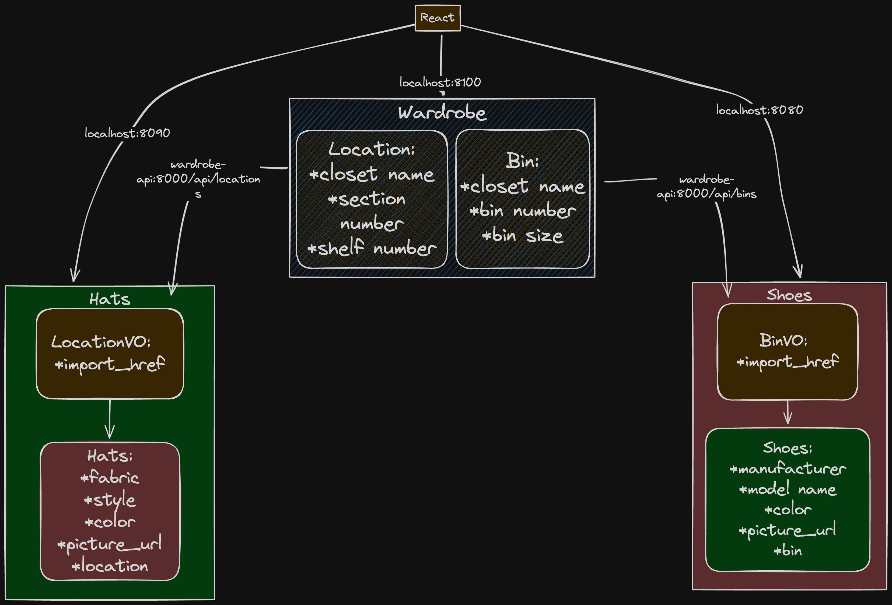

# Wardrobify

Team:

* Yazan Salhani - Hats microservice
* Miranda Pedersen- Shoes Microservice

## Design

## Shoes microservice

In the shoes microservice I have two models. The BinVO model as well as a Shoes model. The BinVO model is used to reach out to the bin model in the wardrobe microservice and return the specific ids of the bins that are there. Those bin ids are given in the Shoes model. The shoes model also presents the name of the manufacturer, the model name, color and a picture url.

## Hats Microservice

The Hats microservice is built using Django and React and consists of two primary models with specific functionalities.

### Models

1. **LocationVO**
   - Used to fetch and store the hrefs from the location model in the wardrobe microservice.

2. **Hat**
   - **Attributes:**
     - **fabric**: String, max length of 200 characters.
     - **style**: String, max length of 200 characters.
     - **color**: String, max length of 200 characters.
     - **picture_url**: String, optional, can be blank or null.
     - **location**: href from the LocationVO, linking to the location model in the wardrobe microservice.

### Views

We have two encoders and two view functions to handle data serialization and HTTP requests.

#### Encoders

1. **LocationVOEncoder**
   - Serializes data from the LocationVO model.

2. **HatsEncoder**
   - Serializes data from the Hat model.

#### View Functions

1. **api_hats**
   - Handles GET and POST requests to list all hats or create a new hat.

2. **api_hat**
   - Handles GET and DELETE requests to retrieve or delete a specific hat.

### React Components

The React application interacts with these models through the following components:

1. **HatForm.jsx**
   - A form for creating a new hat.

2. **HatsList.jsx**
   - Displays all hats in a card format. Each card includes:
     - Fabric
     - Style
     - Color
     - Picture URL
     - Location
     - Delete button to remove a hat

If no hats are available, the page informs the user and provides a link to the HatForm.jsx to add a new hat.

### Usage

To start using the Hats microservice:

1. **Run the Django server**: Ensure your backend is running and accessible.
2. **Navigate to the React application**: Access the HatForm.jsx to add new hats or the HatsList.jsx to view existing hats.

### Conclusion

The Hats microservice efficiently manages hat data and integrates seamlessly with the wardrobe microservice for location information. With a user-friendly React frontend, users can easily create and view hats.

---

Feel free to adjust the sections or add more details specific to your project as needed.
